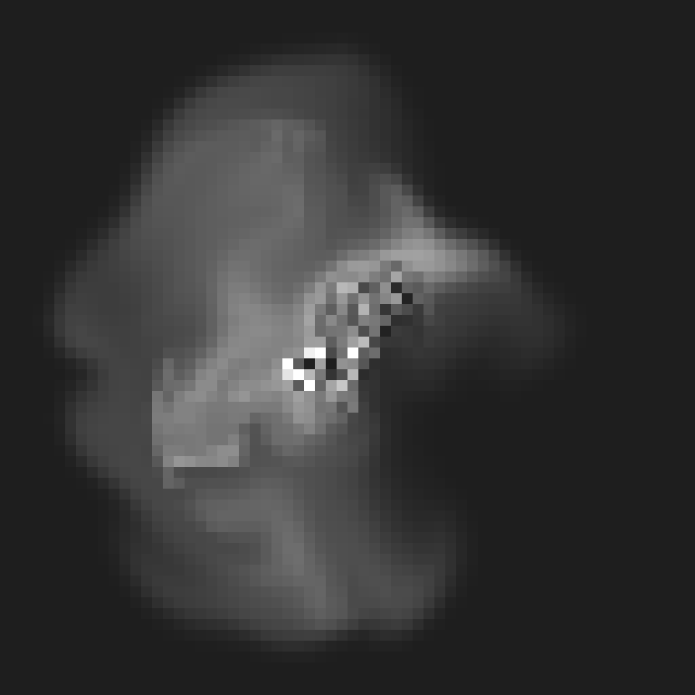
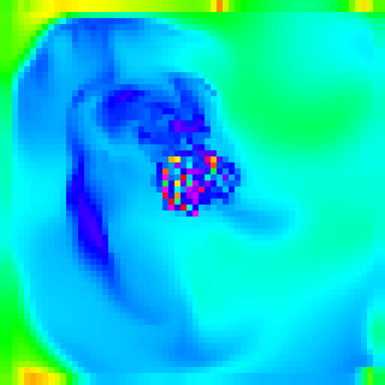

# SFML Fluid Simulation

## Inspiration

This project is based on Mike Ash's implementation of the fluid simulation which was based on Jos Stam's paper on [Real-Time Fluid Dynamics for Games](https://www.dgp.toronto.edu/public_user/stam/reality/Research/pdf/GDC03.pdf). You can find his original implementation [here](https://mikeash.com/pyblog/fluid-simulation-for-dummies.html).

## How to run

Download the repository and open the `sfml-fluid-simulation.sln` file in Visual Studio 2019/2022. Then build and run the project.

## Controls

To cycle between the different rendering modes, press the `Spacebar` key.

To exit the program, press the `Escape` key.

## Configuration

To change the simulation settings, open the `Constants.h` file and change the values of the constants.
